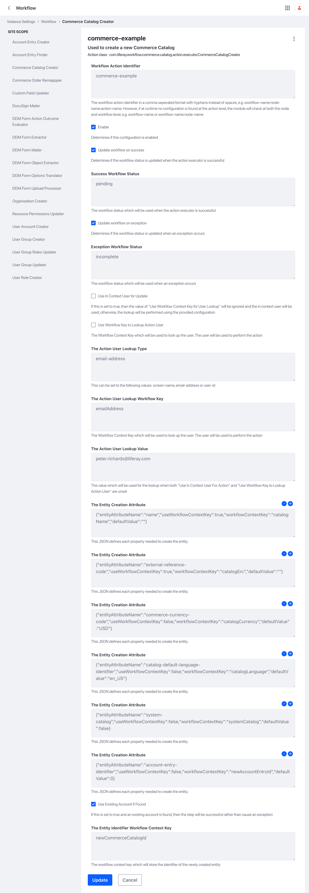
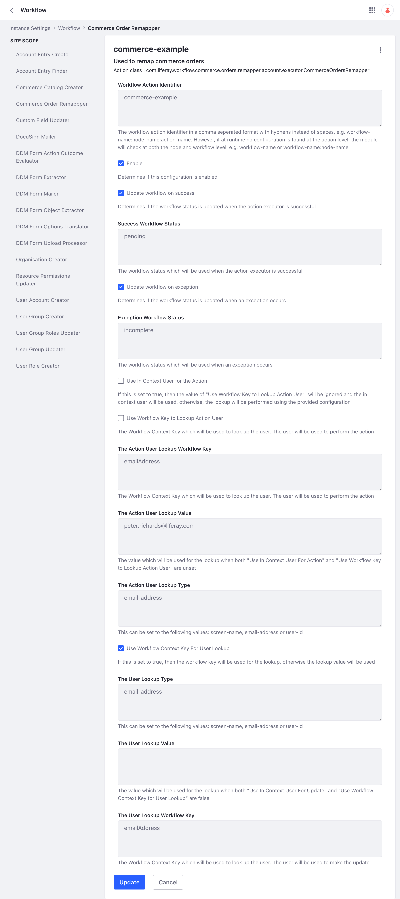

# Commerce Workflow Extensions

A collection of Commerce workflow extensions for Liferay Workflow.

## Enable Logging

The base package of this extension is com.liferay.workflow, as it is for
the [Liferay Workflow Extensions](https://github.com/peterrichards-lr/liferay-workflow-extensions). Therefore, the same
logger can be used for all of these extensions.

## Dependencies

### Liferay Version

These extensions have been tested with 7.4 U92.

### Workflow Extensions Common

The Commerce extensions have a direct dependency on the Workflow Extensions Common module. This module provides common
functionality required by the majority the other modules.

This module is required when compiling the code and at runtime. The [section](#create-a-new-workflow-extension) which
covers how to create a new Workflow Extension details how this dependency should be resolved.

## Example Workflow

The following example is based on an on-boarding use case.

[Use case example](example/README.md)

## Commerce Catalog Creator

This module allows a new Liferay Commerce Catalog to be created using a mixture of workflow context values and default
values specified in the configuration.

### Entry Creation Attributes

The following table indicates which Entry Creation Attributes are required, their type and their default value when not
supplied. The default value here is not the same as the default valued specified in the Entity Creation Attribute JSON.
The default value specified in the Entity Creation Attribute JSON defines the default value if the value cannot be
obtained from the workflow context, the default value specified is what is used when no Entity Creation Attribute JSON
exists for the specific attribute.

| Name                                | Type    | Required | Default Value | Example                                                                                                                                                   |
|-------------------------------------|---------|----------|---------------|-----------------------------------------------------------------------------------------------------------------------------------------------------------|
| name                                | String  | true     | N/A           | {"entityAttributeName":"name","useWorkflowContextKey":true,"workflowContextKey":"catalogName","defaultValue":""}                                          |                                                                                                                                                                                                                                                                                                                                                                                                                                                                                                                                                                                                                                                                                                                                                                                                                                                                                                                                                                                    
| external-reference-code             | String  | true     | null          | {"entityAttributeName":"external-reference-code","useWorkflowContextKey":true,"workflowContextKey":"catalogErc","defaultValue":""}                        |                                                                                                                                                                                                                                                                                                                                                                                                                                                                                                                                                                                                                                                                                                                                                                                                                                                                                                                                                                                    
| commerce-currency-code              | String  | false    | USD           | {"entityAttributeName":"commerce-currency-code","useWorkflowContextKey":false,"workflowContextKey":"catalogCurrency","defaultValue":"USD"}                |                                                                                                                                                                                                                                                                                                                                                                                                                                                                                                                                                                                                                                                                                                                                                                                                                                                                                                                                                                                     
| catalog-default-language-identifier | String  | false    | en_US         | {"entityAttributeName":"catalog-default-language-identifier","useWorkflowContextKey":false,"workflowContextKey":"catalogLanguage","defaultValue":"en_US"} |
| system-catalog                      | Boolean | false    | null          | {"entityAttributeName":"system-catalog","useWorkflowContextKey":false,"workflowContextKey":"systemCatalog","defaultValue":false}                          |
| account-entry-identifier            | long    | false    | 0             | {"entityAttributeName":"account-entry-identifier","useWorkflowContextKey":false,"workflowContextKey":"newAccountEntryId","defaultValue":0}                |

### Dependencies

This module is dependent on the Workflow Extensions Common module.

## Commerce Orders Remapper

This module remaps a Commerce order to a different account. For example, a user creates a basket before they are registered for the site. After the user is created, then this module can attempt to remap the anonymous basket to the new account.

N.B. THIS MODULE IS UNFINISHED.

