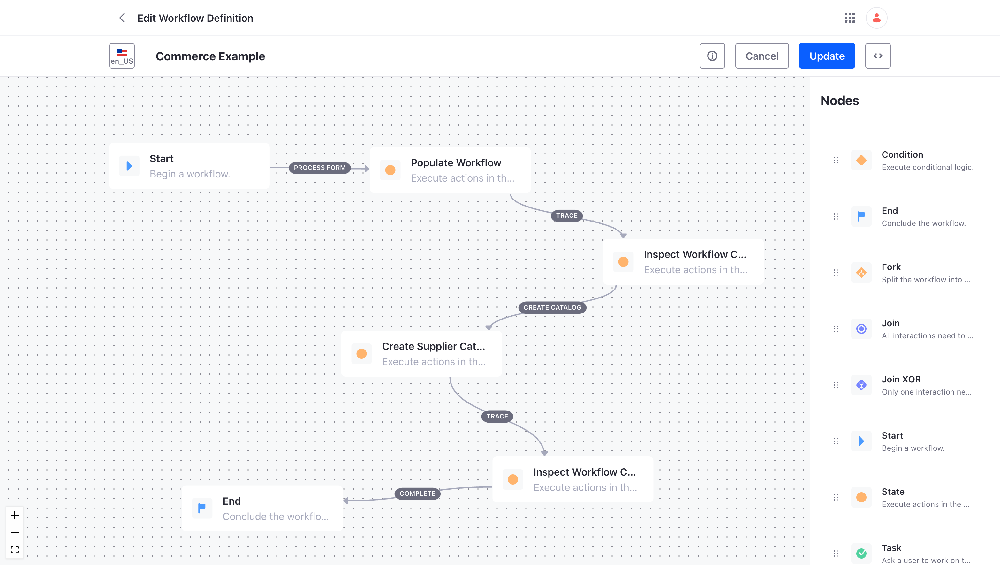
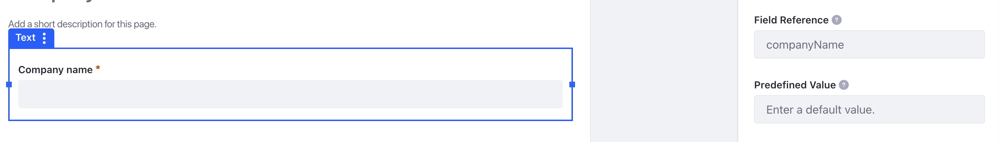

## Use Case Example

[Download Workflow](commerce.xml "download")

### OSGi Configuration Files

The component configuration for this workflow can be found in the [config](config) folder

### Object Definition

This use case example, uses the DDM Form Object Extractor rather than the DDM Form Extractor.

Create a new Liferay Object called Supplier Catalog Request. It only needs a single text field, which is required and should be unique.

The following Object JSON definition could be imported to create the Object. However, it may fail due to changes within the Object framework.

[Download Object JSON](Object_SupplierCatalogRequest_35806_20231103115512056.json "download")

### Form Definition

There are one field, which are key to this example, is Company Name. This field is used for both the Catalog name and its ERC.

Configure the form to use the Supplier Catalog Request object defined above and map the Company Name field.

### Workflow Definition

This is the Groovy script which uses the Company Name. The value of this variable is extracted from the Object linked to the form and used as the name of the Commerce Catalog.

The Object needs to be configured to use the workflow. This is done via the Configuration tab of the Process Builder in the Application Menu.